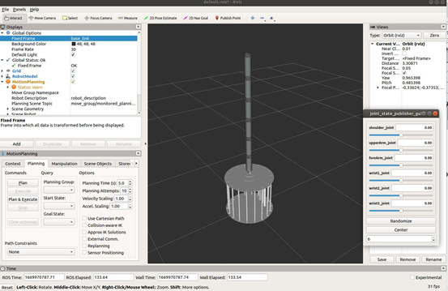
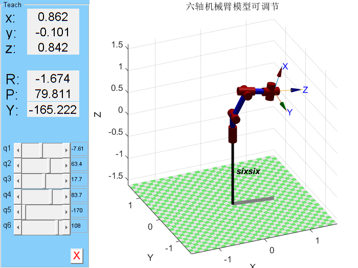
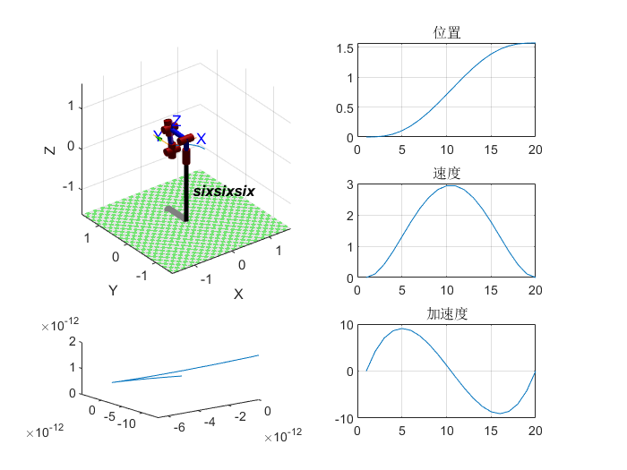
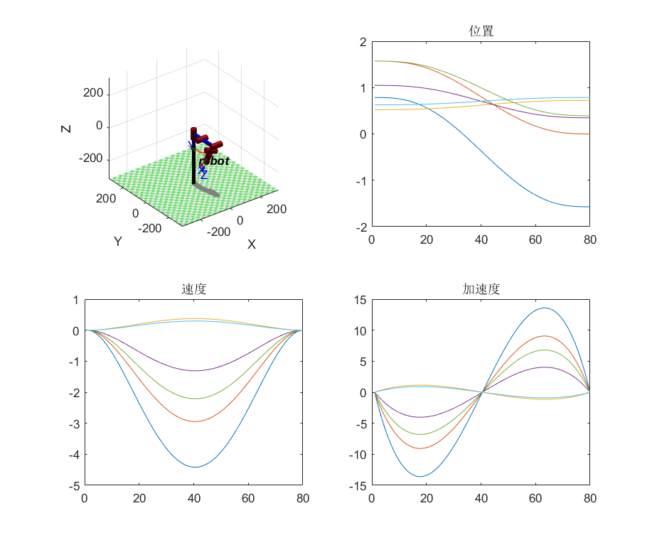
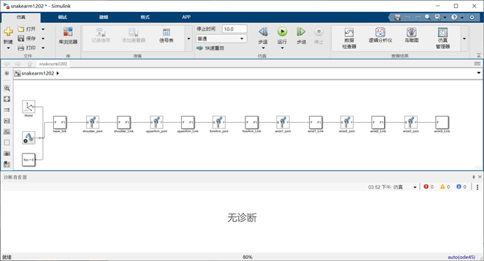
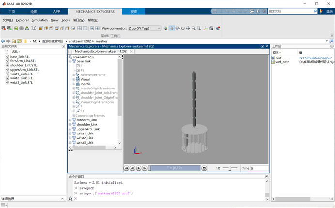
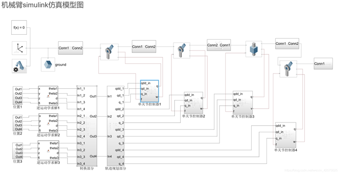

# Muti_joint-snake-robot
## **1.Simulation based on ROS and Rviz**
官网给出的下载链接：
[Moveit download source](https://moveit.ros.org/install/source/)

这里我在CSDN上找到一个下载的教程完成了下载：[moveit_setup](https://blog.csdn.net/qq_38156743/article/details/124131919)

关于solidworks导出urdf文件以及在rviz中的操作，在CSDN上也有一个可以参考的文章：[solidworks2urdf](https://blog.csdn.net/king845/article/details/125918110)
***
## 常见报错的解决思路

- **1.在编译过程中如果出现报错：**
> ERROR: cannot launch node of type [moveit_setup_assistant/moveit_setup_assistant]: Cannot locate node of type [moveit_setup_assistant] in package [moveit_setup_assistant]. Make sure file exists in package path and permission is set to executable (chmod +x)

**尝试解决办法：（在主目录下）**

     catkin build 
    source /opt/ros/melodic/setup.bash
    roslaunch moveit_setup_assistant setup_assistant.launch

- **2.roslaunch display.launch 之后在rviz中看不到模型：**

**解决办法:**
在左边`Global Options`中的`Fixed Frame` 更改为机械臂自己的`base_link`，然后在下方`Add`之后选择`RobotModel`即可以看到机械臂的模型。

***
## 关于ROS中文件结构的一些知识

 ###  Launch文件

- 3.3.1 demo.launch

demo是运行的总结点，打开我们可以看到他include了其他的launch文件。其中第14行说，如果有需要，发布静态的tf。比如说，你的机器人基座不在世界坐标的原点，你可以发布一个静态tf来描述机器人在世界坐标中的位置。第17-21行，就是我们发布虚拟机器人状态的地方了，当然，如果你有实体机器人或者有gazebo之类的模拟器，你需要去掉这一部分，有其他相应的节点来发布机器人状态。26-32行运行了另一个moveit重要的节点，move group。

- 3.3.2 move_group.launch

顾名思义，move group的功能是让一个规划组群动起来。怎么动，那就要做运动规划了，在move_group.launch第24-26行定义了运动规划库的使用，我们可以看到，默认的是使用ompl运动规划库。同样的，如果以后有时间，我会发帖详解如何创建新的运动规划库插件并让moveit使用其他的运动规划算法。其他的都是设置一些基本参数，暂时可以略过。

- 3.3.3 planning_context.launch

这里我们可以看到，定义了所使用的urdf和srdf文件，以及运动学求解库。不建议手动更改这些，但是如果你需要使用不同的urdf，srdf，可以在这里更改。

- 3.3.4 setup_assistant.launch

如果你需要更改一些配置，那么可以直接运行

复制代码

    roslaunch [文件名]_moveit_config setup_assistant.launch 

这样就可以基于当前设置做更改，而不是重新设置。

原文来自于：
[运动规划 (Motion Planning): MoveIt! 与 OMPL](https://blog.csdn.net/cookie909/article/details/79698925)

## **2.Simulation based on Matlab**

### **2.1 相关概念**

关于在Matlab上描述机械臂，之前我有做过一些学习笔记可以参考：
[机器人运动学](https://github.com/Richard17425/FOCUS-Tasks/blob/main/Robotics%E5%AD%A6%E4%B9%A0%E7%AC%94%E8%AE%B0/Chapter7.md)

CSDN上的这篇文章中有关于轨迹规划基本知识的讲解,以及MATLAB相关轨迹规划函数的规划原理以及使用介绍

[matlab smooth函数_MATLAB中的机械臂算法—轨迹规划](https://blog.csdn.net/weixin_39566387/article/details/111203245)

**改进末端跟随法**是一种启发式的机械臂**运动学反解算法**。启发式算法是指具有自学习功能，可利用部分信息对计算产生推理的算法。

### **2.2 仿真平台的搭建**
在CSDN上看到几个在MATLAB上搭建的机械臂轨迹规划仿真，后面可以尝试在此基础上进行改进
- [基于MATLAB的关节型六轴机械臂轨迹规划仿真（2021实测完整代码）](https://blog.csdn.net/mustvvvics/article/details/117025390)
  实现效果如下：
   

关于代码的讲解可以看看b站上这个视频[MATLAB机器人工具箱10.4 机械臂仿真教学](https://www.bilibili.com/video/BV1q44y1x7WC?p=8&vd_source=72cbed57f84134f653cd0ebd0e4e2cff)

- [matlab,机械臂轨迹规划，跟踪轨迹](https://blog.csdn.net/caijifeizai/article/details/104958445)
 
   实现效果如下：
   

其中用到的matlab机械臂的相关函数有：

- `ikine` :通过位姿求得关节角度，**反向动力学函数**，使用ikine对于矩阵，即机械臂头的6DOF信息反推各个关节的角度
- `fkine` :求得关节位姿，**前向动力学函数**，通过给定机械臂的各轴角度，可以计算到转动最后位置的矩阵
- `jtraj` :五次多项式轨迹规划(关节空间轨迹规划)
  
  **规划方法**:已知初始和终止的**关节角度值**。对机械臂的每个关节的运行进行插值，以保证机械臂的各个关节运动的连续性和稳定性。
- `ctraj` :匀加速匀减速规划轨迹(笛卡尔空间轨迹规划)
  
  **规划方法**:已知初始和终止的**末端关节位姿**。对规定好的轨迹进行绘制，即保证机械臂末端的以确定的姿态在规定轨迹上运动。

知乎上有[Matlab机器人工具箱基础代码解释](https://zhuanlan.zhihu.com/p/379449370)

CSDN上有关于这个路径规划算法的讲解:[matlab机器人工具箱 轨迹生成函数jtraj代码详解](https://blog.csdn.net/qq_26751931/article/details/89950925)

b站上看到有关于matlab机械臂工具包的具体教学，很具体就是。[机器人工具箱V9.10](https://space.bilibili.com/417253232/channel/seriesdetail?sid=791232)

`12.15`

把之前做的机械臂的urdf的包导到matlab的simulink中(在urdf包的目录下，在工作区输入：`smimport('xxx.urdf')`，simulink中效果如下：

运行以后效果：

*注意：要先将工作区移到stl文件的目录中，不然无法显示出机械臂模型！* 

在知乎上看到的在simulink上搭建的仿真平台，做了有逆运动学求解和轨迹规划，包括单关节控制的部分，可以跟着后面做一下。链接：
[simulink机械臂仿真与控制（一）Multibody机械臂的搭建](https://zhuanlan.zhihu.com/p/427838340)

